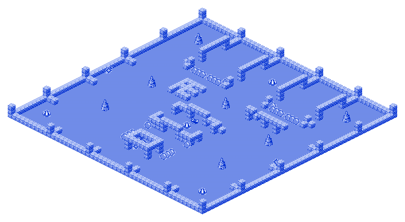
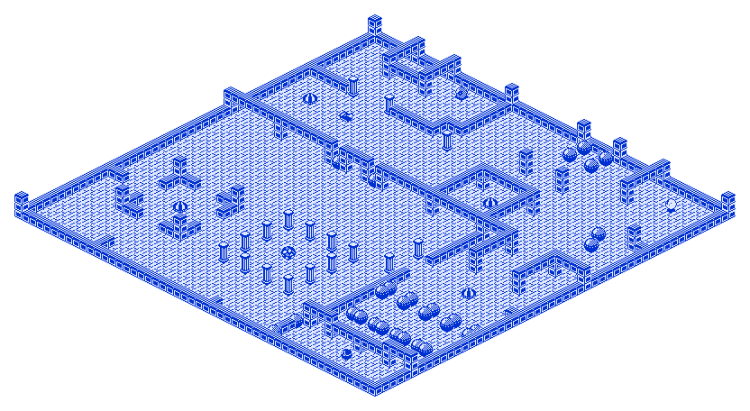
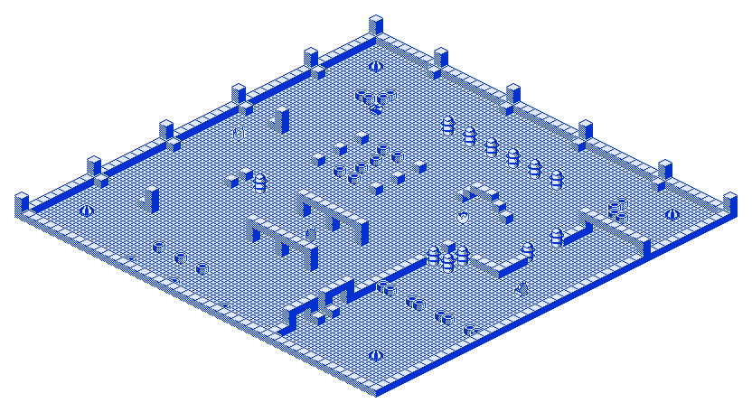

# Alien Evolution - Game info (player-facing)

This is the “how the game really works” document: mechanics, rules, timings, and the kind of details you want if you’re aiming for clean clears and high scores.

It intentionally avoids anything about disassembly, memory maps, tooling, or how the Python port is implemented. If you want that, see `RESEARCH.md`.

---

## What kind of game this is

Alien Evolution is a real-time, grid-based isometric survival/maze game.

You control **CYBORG G4** inside a maze. Aliens are already inside the level, and they **evolve through multiple phases** on a global schedule. In the final phase they **reproduce**, so the alien population can snowball if you let it.

Your job is simple to state and hard to do:

- **Clear the level by reducing the alien population counter to `000`.**
- Do it **before the TIME bar runs out**.
- Don’t lose all your lives.

There are **3 levels**. Clear all 3 to finish the game.

---

## Controls (default keyboard profile)

Default “modern” bindings are:

- **W / A / S / D** - move (up / left / down / right)
- **Space** - use the currently selected weapon/tool
- **Enter** - cycle the selected weapon/tool (MINES → BOMBS → T.N.T → LASER)

Port convenience hotkeys (optional, but useful for practice):

- **F5** - quick save
- **F9** - quick load
- **F10** - reset (back to title)

---

## The HUD

You don’t need to memorize the layout, but you *do* want to understand what each indicator really means:

**SCORE**  
Your score increases mainly from:
- killing aliens,
- “letter” bonus play (see below),
- and a fixed bonus on level clear.

**LIVES**  
- You start the game with **6 lives**.
- You can earn lives back (up to **6**) via the letter bonus system.
- Contact with an alien (or certain explosions/beam hits) costs a life.

**TIME bar**  
- A per-level countdown. If it hits zero, the level is failed.
- It also acts like a “metronome”: key global events are scheduled off TIME ticks.

**ALIEN population counter (3 digits)**  
This is your real objective indicator.
- Starts at **`004`** (because each level begins with exactly **4 aliens**: one in each phase).
- **Increases** when aliens reproduce (new phase‑0 aliens appear).
- **Decreases** when an alien is killed/removed (in any phase).
- The level completes when it reaches **`000`**.

Hidden in plain sight: this counter also influences how quickly you regain heavy-weapon charges (details below).

**Weapon/ammo bars (length 10)**  
- **MINES** is a real inventory count (starts at **10**).
- **BOMBS / T.N.T / LASER** are “charges” that **replenish on evolution pulses** (not continuously).

More detail in the Weapons section.

---

## Core loop: evolution pulses and reproduction

The defining mechanic is the **global evolution pulse**.

On an evolution pulse, every alien advances exactly one phase:

- **Phase 0 (static)** → becomes **Phase 1**
- **Phase 1** → becomes **Phase 2**
- **Phase 2** → becomes **Phase 3**
- **Phase 3** → **reproduces** and returns to **Phase 0**

Reproduction details:

- A phase‑3 alien attempts to place new phase‑0 aliens into the **four orthogonal neighboring tiles** (up, right, down, left).
- A new alien is created **only if the target tile is empty**.
- No diagonals.

So, in open space, one phase‑3 alien can create up to **5** eggs.

### Timing: how often is an evolution pulse?

Time is internally frame-driven, but you can treat it like this:

- The TIME bar advances in “ticks” (roughly every couple of seconds).
- Evolution pulses happen on a **fixed subset** of those ticks (it’s not every tick).
- Early in each level, several evolution pulses happen close together; later, they’re more spread out.

Practical takeaway: the start of a level is where the “evolution tempo” is scariest. If you’re planning a route, plan around that front-loaded pressure.

---

## Level completion and game completion

A level ends immediately when the **alien population counter reaches `000`**.

- Your **time resets** for the next level.
- Your **lives carry over** (you do *not* get reset to 6 after level 1).
- After level 3, the game shows the ending and then goes to high scores.

---

## Movement rules

The world is a **50×50** grid. Every move is one tile in a cardinal direction.

Basic collision rules:

- You can move into an empty tile.
- You cannot move into solid terrain (walls), static alien objects, or most “busy” tiles.
- **Touching an alien is lethal** (either you move into it or it moves into you).

### Pushable blocks

Some levels contain pushable blocks.

Rule is strict and simple:

- If you move into a pushable block and the tile **behind it (same direction)** is empty, the block is pushed one tile forward and you move into its old tile.
- If the tile behind it is not empty, the push fails and you do not move.
- You can only push **one** block at a time (no chains).

Push blocks are one of the biggest skill multipliers in the game: you can reshape corridors, create safe pockets, and manufacture chokepoints for mine play.

---

## Teleport pads

Each level has **4 teleport pads**.

- Stepping onto a pad **instantly teleports** you to another pad.
- The mapping is **one-way** and deterministic: pads form a cycle **T1 → T2 → T3 → T4 → T1**.
- Aliens treat pads as obstacles (they don’t use them).

If you want to play the level like a chessboard (and for high scores, you kind of do), knowing the exact pad cycle matters.

---

## Weapons and tools

You have 4 tools, selected by cycling with **Enter**. Use the current one with **Space**.

A key positioning detail:

- **MINES / BOMBS / T.N.T** are planted **behind you** (on the tile you just left).
- **LASER** is fired **in front of you** (from the tile ahead of your last-move direction).

If the placement tile isn’t suitable (occupied, or not a valid “empty” tile type), the action simply does nothing. (Learning what counts as “placeable floor” is part of routing.)

### MINES

What they are:  
A reusable trap you drop behind you. Great versus early/mid aliens, also useful as a “point farm” on advanced aliens.

How to deploy:
- Press **Space** while MINES is selected.
- A mine is planted on the tile you just left (behind your last move), if that tile is empty.

Ammo:
- Start with **10 mines** (the HUD bar maxes at 10).
- Dropping a mine costs **1**.
- You regain a mine when:
  - you walk over one (picking it back up), or
  - an alien steps onto it (the mine is consumed, but your inventory goes back up by 1).

Interaction:
- **Phase 1 and Phase 2 aliens die** when they step on a mine.
- **Phase 3 aliens do *not* die** - they consume the mine, you get the mine back, and you still get points.
  - That makes “advanced‑alien mine farming” possible, but risky.

### BOMBS

What they are:  
A contact explosive dropped behind you. Think “stronger mine” that creates a small blast zone.

How to deploy:
- Press **Space** while BOMBS is selected.
- A bomb is planted on the tile you just left (behind your last move), if that tile is placeable.

Ammo:
- Bombs use a 0–10 “charge” bar.
- Charges are **replenished on evolution pulses**, not instantly.
- Early in a level you will often have **0 bombs** until the alien population grows.

Blast behavior (practical):
- When a bomb is triggered, it can kill targets on the bomb tile and also hit **adjacent orthogonal tiles** (a small “+” shaped danger zone).
- Bombs are most reliable against **phase 1 and phase 2** aliens.
- Don’t step on your own bomb; don’t stand adjacent when it goes off.

### T.N.T

What it is:  
A heavier contact explosive. Best thought of as your main answer to the **phase‑3 chaser** when you don’t have laser control yet.

How to deploy:
- Press **Space** while T.N.T is selected.
- It is planted behind you (same as BOMBS), if that tile is placeable.

Ammo:
- Same 0–10 charge bar model.
- Replenishes on evolution pulses.

Interaction (high-level):
- T.N.T is the most consistent “placed” tool for killing **phase‑3** aliens.
- It is also dangerous to you in close quarters: treat it as a *do-not-touch* object once planted.

### LASER

What it is:  
A forward attack. Used correctly, it’s the cleanest way to delete high-value targets (including static phase‑0 aliens), and the safest way to stop reproduction chains.

How to deploy:
- Press **Space** while LASER is selected.
- The emitter/beam originates **in front of you**, in the direction of your last movement.

Ammo:
- Same 0–10 charge bar model.
- Replenishes on evolution pulses.

Interaction:
- Laser hits can kill aliens in any phase (including the static phase‑0).
- It can also kill you. If you’re learning the timing/geometry, practice with quick-save.

---

## Heavy-weapon recharge: the exact rule

BOMBS, T.N.T and LASER do not recharge “continuously”. They recharge only when the game runs an evolution pulse, and the amount depends on the **ALIEN population counter**.

Let the population counter be a three-digit number:

- hundreds digit = H
- tens digit = T
- ones digit = O

Recharge bias per evolution pulse:

- If **H > 0** (population ≥ 100): you gain **+10 charges** (capped by the 10‑segment bar).
- Otherwise: you gain **+T charges**.

This bias is applied to **each** of the three heavy tools (BOMBS, T.N.T, LASER), then each bar is capped at 10.

Examples:
- Population `004` → T = 0 → heavy tools won’t recharge.
- Population `17` → T = 1 → +1 charge per evolution pulse.
- Population `58` → T = 5 → +5 charges per evolution pulse.
- Population `103` → H > 0 → +10 (full recharge).

Practical implication:

- If you keep the population under 10 for the whole level, you’ll often be playing almost entirely with mines and movement tech.
- If you let the population climb into double digits, the game starts feeding you heavy tools - but you’re also playing with a bigger infestation.

That tradeoff is one of the game’s main strategic levers.

---

## Enemy phases and behavior

Each phase is a different threat model.

### Phase 0: static

- Does not move.
- Blocks movement.
- Evolves into phase 1 on an evolution pulse.
- Is the “seed” that eventually turns into a reproducing phase‑3 alien if not eliminated.

### Phase 1: roamer

- Moves around corridors with a “keep going until blocked, then turn” feel.
- Dies to mines easily.

### Phase 2: roamer (smarter)

- Similar movement style, but with stronger trap awareness on later levels.
- Still mine‑killable, but less predictable.

### Phase 3: chaser (most dangerous)

- Actively tries to close distance to you.
- On levels 2 and 3 it gains a **line attack**:
  - if it lines up with you (same row or column) *and* it’s facing toward you, it can fire a straight-line shot.
  - It won’t fire if the tile directly in front of it is blocked.

Phase 3 is also the reproduction phase: if you let them cycle, the population explodes.

---

## The letter bonus (extra lives) - how it really works

Periodically, a single **bonus marker** spawns on a random empty tile.

- The marker cycles through **5 symbols/letters** very quickly.
- When you step on it, you “collect” the letter it is currently showing.
- The marker is **consumed** on pickup (you’ll need a fresh spawn for your next letter).

Rules (critical details):

- Each of the 5 letters can be collected **once per set**.
- If you pick up a letter you already collected in the current set, you simply don’t gain a new letter (but you still get the “bank” score for your current progress; see below).
- When you successfully collect all 5 unique letters in a set:
  - you gain **+1 life** (up to the max of **6**),
  - the set resets,
  - and the next marker starts a new set.

Scoring:
- Picking up a **new** letter gives points immediately.
- Every pickup (new or duplicate) also gives “bank” points equal to how many unique letters you currently have in the set.

Expert takeaway:
- This is not just a life mechanic - it’s a scoring mechanic with timing. If you want big scores, you need to be deliberate about *which* letter you pick up on each marker spawn.

---

## Scoring details

If you’re chasing high scores, here’s what matters:

- **Alien kill**: +1 point (credited when the alien is actually removed after its death animation).
- **Mine contact events** also give points (including phase‑3 stepping on a mine, even when it survives).
- **Letter bonus play** gives a steady stream of points and also restores lives.
- **Level clear bonus**: +500 points (awarded as a rolling count-up on the HUD).

There is no time‑remaining bonus. If you farm, you are trading away time for points and (maybe) lives.

---

---

## Expert techniques and patterns

This is not “how to survive your first run” - it’s the stuff that tends to matter when you’re optimizing.

### Population management (weapon economy control)
Because heavy tools recharge based on the *tens digit* of the alien population, you can deliberately choose between:
- keeping the population low (safer, but mostly mine-only), or
- allowing controlled growth into double digits (riskier, but it unlocks a steady flow of bombs/T.N.T/laser).

A common high-score pattern is: stabilize with mines, allow a planned growth spike, cash in heavy tools to wipe, then repeat - without ever letting phase‑3 reproduction chain out of control.

### Mine kite loops  
Mines are planted behind you, and phase‑1/2 aliens die on contact. That makes classic “run a loop through a corridor and salt the floor” extremely strong.

Against phase‑3, mines don’t kill - but they still:
- remove the mine from the floor (reducing clutter),
- refund the mine to your inventory,
- and award points.

So phase‑3 + mines can be used as a point engine, as long as you keep the line‑attack risk under control (levels 2–3).

### Teleport routing
Teleport pads are deterministic and one-way. The skill isn’t “react and hope” - it’s:
- knowing which pad will send you where,
- knowing what safe space exists *around the destination pad*,
- and using the cycle to reposition without giving phase‑3 a clean line.

### Chaser line-of-sight denial (levels 2–3)
Phase‑3 can fire only when:
- you share a row/column, and
- it is facing toward you, and
- the tile directly in front of it is empty.

You can deny shots by:
- staying off the same row/column,
- forcing it to approach from behind walls/blocks,
- or deliberately “cluttering” the tile in front of it (careful: this can also limit your own tools).

### Letter discipline
Because each marker pickup is consumed, your letter play becomes a timing game:
- Don’t pick up a marker unless it’s showing a letter you actually want, unless you’re intentionally cashing bank score.
- If you’re low on lives, prioritize finishing the 5-letter set even if it costs a bit of time.

---

## Appendix: evolution tick schedule

For players who want to route around the exact cadence:

- Each level’s TIME bar consists of **22 internal ticks**.
- On **11** of those ticks, aliens also run an evolution pulse.
- The evolution ticks (counting from the first tick of the level as step 21 down to 0) are:

`21, 20, 19, 18, 16, 14, 13, 10, 7, 4, 2`

This is the same on every level.


## Level reference

For each level you get:
- a unique map layout,
- the same fundamental evolution system,
- but stronger alien behavior in later levels.

### Level 1

Map (isometric):



Key facts:

- Player start: (r27, c25)
- Starting aliens (one per phase):
  - Phase 0 (static): (r05, c04)
  - Phase 1 (roamer): (r25, c02)
  - Phase 2 (roamer): (r27, c47)
  - Phase 3 (chaser): (r40, c25)
- Pushable blocks: 22
- Teleport pads: 4 (see table below)


Teleport cycle:

| Pad | Location | Sends you to | Destination |
|---:|:---:|:---:|:---:|
| T1 | (r07, c25) | → T2 | (r29, c25) |
| T2 | (r29, c25) | → T3 | (r44, c04) |
| T3 | (r44, c04) | → T4 | (r44, c44) |
| T4 | (r44, c44) | → T1 | (r07, c25) |

Level 1 enemy note:
- Phase‑3 chasers do **not** use the ranged line attack here.

### Level 2

Map (isometric):



Key facts:

- Player start: (r13, c09)
- Starting aliens (one per phase):
  - Phase 0 (static): (r36, c24)
  - Phase 1 (roamer): (r03, c44)
  - Phase 2 (roamer): (r02, c14)
  - Phase 3 (chaser): (r46, c42)
- Pushable blocks: 28
- Teleport pads: 4 (see table below)


Teleport cycle:

| Pad | Location | Sends you to | Destination |
|---:|:---:|:---:|:---:|
| T1 | (r13, c04) | → T2 | (r15, c31) |
| T2 | (r15, c31) | → T3 | (r29, c42) |
| T3 | (r29, c42) | → T4 | (r37, c10) |
| T4 | (r37, c10) | → T1 | (r13, c04) |

Level 2 enemy notes (difficulty bump):
- Phase‑3 chasers gain the **ranged line attack**.
- Phase‑2 roamers gain a simple “lookahead”: if a mine is two tiles ahead in their current direction, they are more likely to turn away.

### Level 3

Map (isometric):



Key facts:

- Player start: (r10, c10)
- Starting aliens (one per phase):
  - Phase 0 (static): (r19, c31)
  - Phase 1 (roamer): (r23, c04)
  - Phase 2 (roamer): (r32, c23)
  - Phase 3 (chaser): (r25, c45)
- Pushable blocks: 28
- Teleport pads: 4 (see table below)


Teleport cycle:

| Pad | Location | Sends you to | Destination |
|---:|:---:|:---:|:---:|
| T1 | (r04, c04) | → T2 | (r04, c45) |
| T2 | (r04, c45) | → T3 | (r44, c04) |
| T3 | (r44, c04) | → T4 | (r44, c44) |
| T4 | (r44, c44) | → T1 | (r04, c04) |

Level 3 enemy notes:
- Phase‑3 line attack remains enabled.
- Phase‑1 roamers also gain extra wall lookahead (they adjust direction sooner around corridors).
- Overall navigation pressure is higher because of the layout and block placement.

---

## Top-down schematics (50×50)

These are **not** required to play, but they’re extremely useful for routing and for understanding how teleport pads and chokepoints relate.

Legend:
- `#` wall
- `B` pushable block
- `T` teleport pad
- `P` player start
- `s` static alien start (phase 0)
- `e` roamer start (phase 1)
- `m` roamer start (phase 2)
- `A` chaser start (phase 3)
- `.` empty

### Level 1 schematic

```text
   00000000001111111111222222222233333333334444444444
   01234567890123456789012345678901234567890123456789
00 ##################################################
01 #.........#.........#.........#.........#........#
02 #.........#.........#.........#.........#........#
03 #.........#.........#.........#.........#........#
04 #.........#.........#.........#.........#........#
05 #...s............................................#
06 #....#...........................................#
07 #........................T..................#....#
08 #................................................#
09 #................................................#
10 #.........#.........#.........#.........#........#
11 #................................................#
12 #................................................#
13 #........##........B#.........#B........##.......#
14 #.........#.BBB.BBB.#.........#.BBB.BBB.#........#
15 #................................................#
16 #................................................#
17 #................................................#
18 #.............#####..............................#
19 #.............#.#........#.....#...#..#........###
20 ###...........#####..............................#
21 #.............#.#................................#
22 #.............#.###..............................#
23 #.........#.............................#........#
24 #................................................#
25 #.e..............................................#
26 #..................##..#...#..##.................#
27 #...................#....P....#................m.#
28 #................................................#
29 #........................T.....................###
30 ###..............................................#
31 #...................#.........#..................#
32 #................................................#
33 #...................####...####..................#
34 #...................B.........B..................#
35 #.........#.............................#........#
36 #................................................#
37 #................................................#
38 #...................B.........B..................#
39 #...................B..#....#.B................###
40 ###.................B....A....B..................#
41 #................................................#
42 #......................#....#....................#
43 #................................................#
44 #...T.......................................T....#
45 #................................................#
46 #................................................#
47 #.........#.........#.........#.........#........#
48 #.........#.........#.........#.........#........#
49 ##################################################
```

### Level 2 schematic

```text
   00000000001111111111222222222233333333334444444444
   01234567890123456789012345678901234567890123456789
00 ##################################################
01 #..................#..........B..B...............#
02 #.............m....#.............................#
03 #..................#..........B..B..........e....#
04 #.....#....#.......#.............................#
05 #..................#....................#........#
06 #..................#.............................#
07 #................###.............................#
08 #................#...........#....#..............#
09 #######....#######...............................#
10 #...................#............................#
11 #..............................................###
12 #..........................................B.....#
13 #...T....P..................#......#.............#
14 #...........................................B....#
15 #..............................T.................#
16 #................................................#
17 #................................................#
18 #................................................#
19 #................................................#
20 #......#......#B#..#B#......#......#...#.....#...#
21 #..................................#.............#
22 #..................................#.............#
23 #..................................#.............#
24 #..................................#.............#
25 #..................................#...#.....#...#
26 #..................................#.............#
27 #................................#.#.............#
28 #................................................#
29 #.........................................T.....##
30 #................................................#
31 #................................#.#.............#
32 #...................#..#..#..#.....#.............#
33 #.....###...###....................#.............#
34 #.....#.......#....................#B..B..B..B..B#
35 #.....#.......#.....#........#.....#B..B..B..B..B#
36 #.......................s..........#.............#
37 ###.......T........................#.............#
38 #...................#........#.....#.............#
39 #.....#.......#....................#.............#
40 #.....#.......#....................#.BB.BB.BB.BB.#
41 #.....###...###.....#..#..#..#.....#.............#
42 #..................................#.............#
43 #..................................#.............#
44 #..................................#..#...#...#..#
45 #.................................B..............#
46 #.................................#.......A......#
47 #.........#.......................#..............#
48 #.........#...............#.......B..............#
49 ##################################################
```

### Level 3 schematic

```text
   00000000001111111111222222222233333333334444444444
   01234567890123456789012345678901234567890123456789
00 ##################################################
01 #........#.........#.........#..........#........#
02 #................................................#
03 #................................................#
04 #...T........................................T...#
05 #................................................#
06 #.......................................B........#
07 #........B..............................B........#
08 #........B........#..#..#..#..#..#.......BB......#
09 ##.....BB........................................#
10 #.........P......................................#
11 #................................................#
12 #........................................#.......#
13 #........................................#.......#
14 #........................................#.......#
15 #............#..B.B..#...................#.......#
16 #...........................#.....#......#.......#
17 #................B...............................#
18 #............#.......#...........................#
19 ##...##..........B.............s.................#
20 #........................................#.......#
21 #............#..B.B..#...................#.......#
22 #........................................#.......#
23 #...e....................................#.......#
24 #.................................#...####.......#
25 #....................................#.......A...#
26 #................................................#
27 #..................................#.#...........#
28 #.........#.......................#..............#
29 ##...........#.....#...#...#......#..............#
30 #.........#.......................#..............#
31 #.................................#..............#
32 #......................m..........#..............#
33 #.................................#..............#
34 #.................................#BB..BB..BB..BB#
35 #.................................#..............#
36 #..................#...#...#......#..............#
37 #.................................#..............#
38 #.................................#..............#
39 ##.....##........................................#
40 #................................................#
41 #.................................##.............#
42 #................................................#
43 #.................................##.............#
44 #...T.........B..B..B.......................T....#
45 #................................................#
46 #.................................#..............#
47 #.................................#..............#
48 #.............B.....B......B......#..............#
49 ##################################################
```
