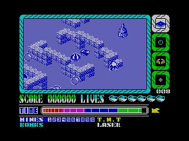

# Alien Evolution (ZX Spectrum) -> Modern Python Port

`Alien Evolution` is a classic 1987 isometric action game in which CYBORG G4 fights an alien population that keeps evolving into stronger forms.

<table>
  <tr>
    <td></td>
    <td></td>
  </tr>
</table>

## Project Goals

- Preserve a historically important game in a form that is easy to run and inspect on modern hardware.
- Perform reverse engineering to recover implementation methods used in the original ZX version.
- Document the game loop and runtime behavior for education and long-term maintainability.
- Provide a practical scriptable environment for automation, bot development, and ML experiments.

## Quick Start (Interactive)

```bash
uv sync
uv run alienevolution
```

Default controls:
- `W/A/S/D`: move
- `Space`: action/fire
- `Enter`: cycle weapon mode

Quality-of-life hotkeys:
- `F5`: quick-save
- `F9`: quick-load
- `F8`: rollback
- `F7`: manual checkpoint

## CLI and Automation Docs

- For headless CLI usage, JSONL telemetry, FMF recording/playback, RZX input, state I/O, and reusable ZX -> Python/Pyxel porting infrastructure, see [PORTING_GUIDE.md](PORTING_GUIDE.md).
- For bot development and ML-oriented workflows, see [AI.md](AI.md).

## Documentation Guide

- [GAME_INFO.md](GAME_INFO.md) explains the game as a player-facing system: goals, controls, enemy evolution, weapon roles, and level flow.
- [RESEARCH.md](RESEARCH.md) captures research on the original ZX game: runtime behavior, data models, decoded code families, and Skool-based reverse-engineering materials.
- [PORTING_GUIDE.md](PORTING_GUIDE.md) contains implementation infrastructure: shared runtime contracts, module layout, CLI/file I/O tools, FMF/RZX pipelines, and reproducible execution workflow.
- [AI.md](AI.md) focuses on bot and ML integration: control interfaces, telemetry semantics, and practical automation strategy.
- [OPEN_ISSUES.md](OPEN_ISSUES.md) tracks open fidelity gaps and unresolved technical discrepancies.
