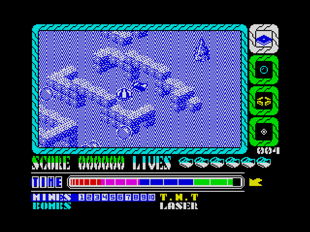

# Alien Evolution

A fidelity-first Python/Pyxel preservation port of the 1987 ZX Spectrum game, designed as an inspectable and reproducible research artifact.

[Play in browser](https://alepoydes.github.io/alien-evolution-pyport/play/) | [Docs](https://alepoydes.github.io/alien-evolution-pyport/)

- Preservation-first port with close behavioral correspondence to the original game
- Inspectable runtime with deterministic replay, save/load, and headless stepping
- Mixed-rights repository; licensing boundary documented in [RIGHTS.md](RIGHTS.md)



> Status: active preservation port
> Audience: reverse engineering, preservation, and research
> Builds: browser build and installable Python package available
> Rights: mixed-rights repository; see [RIGHTS.md](RIGHTS.md)

## Overview

`Alien Evolution` is a **1987** isometric action game for the **Sinclair ZX Spectrum** (48K and 128K). You play as **CYBORG G4**, an android deployed to the surface after a nuclear catastrophe to contain an alien outbreak. The game looks like a compact arcade arena, but the pressure comes from the aliens’ life cycle: if you leave them alive, they **evolve through several stages**, becoming faster and more aggressive, and eventually **lay eggs**, increasing the population. So the moment-to-moment problem is not only aiming; it is deciding what must be eliminated now in order not to fight twice as much later.

This repository is a modern **Python/Pyxel** preservation port of the original ZX game. The aim is fidelity first: behaviour, timing, and presentation that match the 8-bit version as closely as we can justify, while also making the program easier to run, inspect, and experiment with (including headless stepping, deterministic replay from recorded inputs, and state snapshots for reproducible resets).

This project also relied heavily on [SkoolKit](https://github.com/skoolkid/skoolkit) and [Fuse (the Free Unix Spectrum Emulator)](https://fuse-emulator.sourceforge.net/) for source-level analysis, and on [Pyxel](https://github.com/kitao/pyxel) for implementing this preservation port. Many thanks to these projects and their maintainers, they made this work substantially easier.

## Rights and Preservation Notice

This repository is a mixed-rights preservation project, not a uniformly MIT-licensed game package. The original 1987 game *Alien Evolution*, along with its title, audiovisual expression, gameplay assets, characters, and other original expressive elements, remains the property of its original authors and any other applicable rightsholders.

The repository [LICENSE](LICENSE) applies to Igor Lobanov-authored code and documentation except for explicitly excluded paths. Original-game-derived material currently excluded from the MIT grant includes `src/alien_evolution/alienevolution/blocks.py`, `figs/`, `recordings/`, and `skool/`. The authoritative rights boundary is documented in [RIGHTS.md](RIGHTS.md).

This project does not claim ownership of the original game and is not presented as a commercial replacement for it. Its purpose is preservation, documentation, reverse engineering, education, long-term maintainability, and research. The Python package remains installable, but the repository and source distribution are intentionally mixed-rights.

## Alien Evolution in its 1987 context

To place *Alien Evolution* properly, it helps to remember what the ZX Spectrum market looked like in **1987**. The machine was widespread, cassette distribution was mature, and players had become fluent in the “fake 3D” grammar of **isometric** games, an economical way to suggest depth without any 3D hardware. In that setting, a successful design usually did not come from having *more* mechanics, but from choosing one or two rules that interact in a way the player can feel.

### Origins and release

*Alien Evolution* was released in **1987** for the Spectrum and published by **Gremlin Graphics Software Ltd** at a **£4.99** price point, which puts it squarely in the mass-market cassette era.  
The credited authors are **Marco Paulo Carrasco** and **Rui Manuel Tito**, teenage developers from Portugal. Like many Spectrum programmers, they worked in the “bedroom coder” tradition: small teams, limited resources, and an unusually direct relationship between what the hardware could do and what the design became.

A detail that matters historically is that this was not simply a UK production for a UK platform. Later historical writing on Portuguese videogame development (notably by Nelson Zagalo) describes Carrasco and Tito’s path from the early Portuguese Spectrum scene into a publishing relationship with Gremlin, and notes that *Alien Evolution* became their **largest commercial success**, reportedly returning **more than £20,000**, a remarkable result for two 18-year-olds working at home.

### Design: escalation evolution and reproduction

Narratively, the game is classic 1980s science fiction: humanity survives underground after a nuclear holocaust and sends an android _CYBORG G4_ to reclaim the surface from hostile alien life. Mechanically, however, the game is more about *containment* than extermination.

The defining rule is simple: aliens become more dangerous, if you fail to destroy them in time. Each alien progresses through an evolution sequence with multiple behavioural phases (including three mobile stages), and the final stage is reproductive: it lays eggs, adding new aliens and quickly turning a manageable situation into a busy one. 

That lifecycle plays out inside a very Spectrum-specific spatial toolkit: an **isometric** arena, **transporters** that relocate you across the map, and **pushable blocks** that let you trap, funnel, or delay movement. In other words, the game’s difficulty is not only in reaction time; it is in *space management*. You are steering a population through corridors you can partially reshape, under a rule-set where postponing a kill is a strategic choice with delayed cost.

### Reception, distribution, and why it still matters

Contemporary magazine coverage treated *Alien Evolution* as a competent and slightly unusual entry in the isometric action‑maze family rather than a throwaway licensed product. Review scores from 1987 tend to cluster in the mid‑70s to around 80 (for example: **Crash** 75/100, **Your Sinclair** 8/10, **ASM** 9/12, **MicroHobby** 7/10). The game also travelled across European distribution channels, including a same‑year re‑release by **Erbe Software S.A.**

Its longer-term legacy is modest but real. Part of it is cultural: the game is a compact example of how 8‑bit designers could generate tension from a few interacting rules. And part of it is methodological: the original Spectrum program is small enough to study in detail, which makes it a good specimen for reverse engineering and “software archaeology”; you can actually connect low-level implementation choices to player-facing behaviour.

This port continues that afterlife by turning *Alien Evolution* into an inspectable, scriptable modern program while documenting the evidence trail used to understand the original behaviour and keeping the repository's licensing boundary explicit.

**Historical references (for primary context):**
- World of Spectrum entry (release data, credits, archive artifacts): https://worldofspectrum.org/archive/software/games/alien-evolution-gremlin-graphics-software-ltd
- Nelson Zagalo (2015), *Video Games Around the World (Portugal)* (contextual history; see figure/caption page): https://www.researchgate.net/figure/Paradise-Cafe-1985-top-left-Alien-Evolution-1987-top-right-Portugal-1111_fig1_323255356
- Magazine-review aggregation with sources/issues (Crash, Your Sinclair, ASM, MicroHobby): https://www.uvlist.net/game-11914-Alien%2BEvolution

## Project Goals

- Preserve a historically interesting game in a form that is easy to run and inspect on modern hardware. This is not a loose rewrite: Python functions are mapped to routines from the original code, and Python variables mirror the original data blocks, so the gameplay mechanics stay behaviorally equivalent to the source game.
- Treat the original ZX version as an artefact: reverse‑engineer data formats, update rules, and implementation patterns typical of late‑1980s Z80-era programming.
- Document the game loop and runtime behaviour for education and long-term maintainability.
- Provide a practical, scriptable environment for automation, bot development, and machine‑learning research (with a particular emphasis on reinforcement learning).

The ML angle is not an afterthought. 8‑bit games occupy a useful middle ground as learning environments: they are fast and deterministic enough that you can afford *millions* of steps on ordinary hardware, but they are still rich enough to test the things that break simple agents: perception from pixels, exploration under risk, delayed consequences, and planning with irreversible state changes.

*Alien Evolution* is especially convenient for this because its alien lifecycle creates delayed, compounding effects:
- **Credit assignment that is “about time”:** the most important mistake is often not an incorrect action, but an omitted one. Allowing an alien to survive long enough to evolve (or reproduce) creates consequences tens or hundreds of frames later.
- **Endogenous non-stationarity:** the effective difficulty is partly under the agent’s control. If you keep the population young, the environment stays tractable; if you let it age and multiply, the same map becomes chaotic.
- **Hybrid control + planning:** you need short-horizon movement/shooting *and* longer-horizon decisions about when to cull, herd, or trap the population.
- **Structured difficulty and curricula:** the life cycle provides a natural progression for curriculum training and staged evaluation (e.g., “prevent reproduction first,” then “optimize clearing speed”).
- **Multiple observation modalities:** the headless runner can output the Spectrum-style screen bitmap and attribute data per frame, which lets you compare raw-pixel agents against more structured representations.
- **Reproducibility as a first-class feature:** deterministic replay from logged inputs, plus full state save/load, makes it practical to do controlled ablations, counterfactual rollouts (“same start, different policy”), offline datasets, and regression tests for learned behaviour.

There is also a nice symmetry here for research: because the original logic is compact enough to reverse-engineer, you can use modern learning methods not only to *play* the game, but to *recover* it: learning predictive world models, extracting object-level representations from pixels, and comparing learned dynamics against the ground truth recovered through analysis.

## Quick Start (Interactive)

```bash
uv sync
uv run alienevolution
```

Default controls:
- `W/A/S/D`: move
- `Space`: action/fire
- `E`: cycle weapon mode
- Desktop cheats: type `lvl1`, `lvl2`, or `lvl3`, then pause for about 1 second to apply

Quality-of-life hotkeys:
- `F5`: quick-save
- `F9`: quick-load
- `F8`: rollback
- `F7`: manual checkpoint

Cheat commands are disabled in the web build.

## Project Documents

- [README.md](https://github.com/alepoydes/alien-evolution-pyport/blob/main/README.md) is the main overview: historical context, web play link, and quick start.
- [RIGHTS.md](RIGHTS.md) is the authoritative statement of the repository's mixed-rights licensing boundary.
- [CITATION.cff](CITATION.cff) provides citation metadata for research and preservation references.
- [GAME_INFO.md](GAME_INFO.md) explains the game as a player-facing system: goals, controls, enemy evolution, weapon roles, and level flow.
- [RESEARCH.md](RESEARCH.md) captures research on the original ZX game: runtime behavior, data models, decoded code families, and Skool-based reverse-engineering materials.
- [PORTING_GUIDE.md](PORTING_GUIDE.md) contains the porting and runtime infrastructure: shared contracts, module layout, file I/O, FMF/RZX pipelines, and reproducible execution workflow.
- [CLI_UTILITIES.md](CLI_UTILITIES.md) documents the command-line tools and practical invocation patterns.
- [AI.md](AI.md) focuses on bot and ML integration: control interfaces, telemetry semantics, and practical automation strategy.
- [DEVELOPMENT.md](DEVELOPMENT.md) covers local development, testing, packaging, and GitHub Pages deployment.
